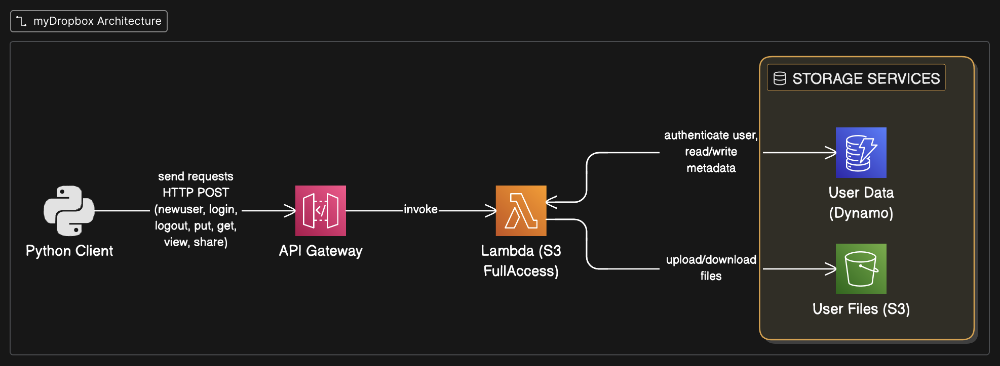

# Activity 5: My DropBox

A serverless file storage system built with AWS Lambda, S3, and API Gateway that provides Dropbox-like functionality for uploading, viewing, and downloading files.



## Source Code Files

### 1. lambda_function.py

**AWS Lambda Handler for File Operations**

This is the backend serverless function that handles all file operations. It runs on AWS Lambda and is triggered via API Gateway.

**Functionality:**

- **Database Management**: Uses S3 to store system metadata (user files info) in `system/system_data.json`
- **File Upload (PUT)**: Receives base64-encoded files and stores them in S3 under `files/{username}/{filename}`
- **File Listing (VIEW)**: Returns a list of files owned by or shared with the requesting user
- **File Download (GET)**: Retrieves files from S3 and returns them as base64-encoded data
- **Access Control**: Manages file ownership and sharing permissions

**Key Components:**

- `get_db()`: Retrieves system metadata from S3
- `save_db()`: Saves updated metadata back to S3
- `create_file()`: Creates file metadata entries
- `lambda_handler()`: Main entry point that routes commands to appropriate handlers

### 2. client.py

**Command-Line Client for File Operations**

A Python CLI application that interacts with the Lambda function through API Gateway.

**Functionality:**

- **Interactive Shell**: Provides a command-line interface for file operations
- **PUT Command**: Uploads local files to the cloud storage
- **VIEW Command**: Lists all accessible files with metadata
- **GET Command**: Downloads files from cloud storage to local system
- **Base64 Encoding**: Handles binary file conversion for JSON transport

**Commands:**

- `put <filename>`: Upload a file
- `view`: List all accessible files
- `get <filename> [owner]`: Download a file
- `quit`: Exit the application

---

## API Documentation

### Endpoint

```
POST "https://09p1vu39ve.execute-api.us-east-1.amazonaws.com/default/activity-5"
```

### Authentication

Currently uses username-based identification passed in request body (not production-ready authentication).

---

## API Operations

### 1. Upload File (PUT)

Uploads a file to the cloud storage system.

**Request Format:**

```json
{
  "command": "put",
  "username": "user123",
  "filename": "document.pdf",
  "file_data": "base64_encoded_file_content_here..."
}
```

**Request Fields:**

- `command` (string, required): Must be "put"
- `username` (string, required): Username of the file owner
- `filename` (string, required): Name of the file
- `file_data` (string, required): Base64-encoded file content

**Response Format:**

```json
{
  "statusCode": 200,
  "body": "{\"message\": \"Upload Successful\"}"
}
```

**Example using curl:**

```bash
# First, encode your file to base64
FILE_B64=$(base64 -i myfile.txt)

# Send the request
curl -X POST "https://09p1vu39ve.execute-api.us-east-1.amazonaws.com/default/activity-5" \
  -H "Content-Type: application/json" \
  -d '{
    "command": "put",
    "username": "john_doe",
    "filename": "myfile.txt",
    "file_data": "'$FILE_B64'"
  }'
```

---

### 2. List Files (VIEW)

Retrieves a list of all files accessible to the user.

**Request Format:**

```json
{
  "command": "view",
  "username": "user123"
}
```

**Request Fields:**

- `command` (string, required): Must be "view"
- `username` (string, required): Username requesting the file list

**Response Format:**

```json
{
  "statusCode": 200,
  "body": "{\"message\": [{\"filename\": \"document.pdf\", \"owner\": \"user123\", \"shared_with\": [], \"s3_key\": \"files/user123/document.pdf\", \"size\": 1024, \"last_modified\": \"2026-02-08T10:30:00.123456\"}, {...}]}"
}
```

**Response Fields in message array:**

- `filename` (string): Name of the file
- `owner` (string): Username of the file owner
- `shared_with` (array): List of usernames with access
- `s3_key` (string): S3 storage key
- `size` (integer): File size in bytes
- `last_modified` (string): ISO format timestamp

**Example using curl:**

```bash
curl -X POST "https://09p1vu39ve.execute-api.us-east-1.amazonaws.com/default/activity-5" \
  -H "Content-Type: application/json" \
  -d '{
    "command": "view",
    "username": "john_doe"
  }'
```

---

### 3. Download File (GET)

Downloads a specific file from the cloud storage.

**Request Format:**

```json
{
  "command": "get",
  "username": "user123",
  "filename": "document.pdf"
}
```

**Request Fields:**

- `command` (string, required): Must be "get"
- `username` (string, required): Owner of the file or user with shared access
- `filename` (string, required): Name of the file to download

**Response Format:**

```json
{
  "statusCode": 200,
  "body": "{\"message\": \"base64_encoded_file_content_here...\"}"
}
```

The `message` field contains the base64-encoded file content that needs to be decoded before saving.

**Example using curl:**

```bash
# Download and decode the file
curl -X POST "https://09p1vu39ve.execute-api.us-east-1.amazonaws.com/default/activity-5" \
  -H "Content-Type: application/json" \
  -d '{
    "command": "get",
    "username": "john_doe",
    "filename": "myfile.txt"
  }' | jq -r '.body | fromjson | .message' | base64 -d > downloaded_file.txt
```

---

## Setup Instructions

### Prerequisites

- AWS Account with Lambda, S3, and API Gateway access
- Python 3.8+
- `boto3` library (for Lambda)
- `requests` library (for client)

### Lambda Setup

1. Create an S3 bucket named `act-5` (or update `BUCKET_NAME` in code)
2. Create a Lambda function with Python 3.x runtime
3. Upload `lambda_function.py` as the function code
4. Add S3 read/write permissions to the Lambda execution role
5. Set appropriate timeout (e.g., 30 seconds) and memory (e.g., 256 MB)

### API Gateway Setup

1. Create a new REST API
2. Create a POST method that integrates with your Lambda function
3. Enable CORS if needed
4. Deploy the API to a stage (e.g., `prod`)
5. Note the Invoke URL

### Client Setup

1. Install required Python package:
   ```bash
   pip install requests
   ```
2. Update `API_URL` in `client.py` with your API Gateway endpoint
3. Run the client:
   ```bash
   python client.py
   ```

---

## Usage Example

```bash
$ python client.py
Welcome to myDropbox! Type 'help' for commands.
user put test.txt
OK
user view
test.txt 156 2026-02-08T10:30:00.123456 user
user get test.txt
OK
user quit
```

---

## Data Storage Structure

> **📝 Implementation Note**: The system architecture diagram above shows **DynamoDB** for metadata storage, which represents the ideal architecture and will be implemented in the next class assignment. However, the **current implementation** (this assignment) uses **S3** (`system/system_data.json`) to store file metadata for simplicity. The file storage in S3 remains the same in both versions.

### Current Implementation: S3-Based Storage

**S3 Bucket Structure:**

```
act-5/
├── system/
│   └── system_data.json          # Metadata for all files (current implementation)
└── files/
    ├── user1/
    │   ├── file1.txt
    │   └── file2.pdf
    └── user2/
        └── file3.jpg
```

**System Metadata Format (stored in S3):**

```json
{
  "user": {},
  "files": [
    {
      "filename": "document.pdf",
      "owner": "user123",
      "shared_with": [],
      "s3_key": "files/user123/document.pdf",
      "size": 1024,
      "last_modified": "2026-02-08T10:30:00.123456"
    }
  ]
}
```

### Future Implementation: DynamoDB + S3

**Architecture (as shown in diagram):**

- **DynamoDB Table**: Stores user data and file metadata with fast querying capabilities
- **S3 Bucket**: Stores actual file content only

**DynamoDB Table Structure (Next Assignment):**

_Users Table:_

```
Primary Key: username (String)
Attributes: email, created_at, storage_used, etc.
```

_Files Table:_

```
Primary Key: file_id (String)
Sort Key: owner (String)
Attributes: filename, s3_key, size, last_modified, shared_with, etc.
```

**Benefits of DynamoDB:**

- Fast queries and indexed searches
- Better scalability for metadata operations
- Support for complex queries (e.g., find all files shared with user)
- Atomic updates and transactions
- No need to read/write entire metadata file on each operation

---

## Error Handling

- **File Not Found**: Returns "Error: Unknown Command" if command is invalid
- **Access Denied**: Only file owner and shared users can view/download files
- **Upload Errors**: Check Lambda logs for S3 permission issues
- **Client Errors**: Displays "File not found" or "Download Error" for failed operations

---
