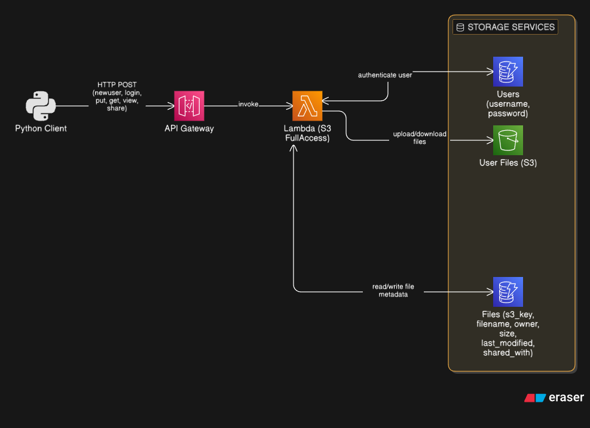

# myDropbox

A command-line cloud storage application (similar to Dropbox) built using AWS Serverless architecture (API Gateway, Lambda, S3, and DynamoDB).

## Source Code Files

- **`client.py`**: The command-line interface (CLI) application. It interacts with the backend API to perform user management and file operations.
- **`lambda_function.py`**: The backend logic running on AWS Lambda. It manages user authentication, file metadata in DynamoDB, and file storage in S3.

## System Architecture


### S3 Design
Files are stored in an S3 bucket with a prefix-based structure to ensure isolation between users:
- **Structure**: `files/{owner_username}/{filename}`
- **Permissions**: Managed by the Lambda function which enforces access control based on ownership and sharing.

### DynamoDB Design
The system uses two DynamoDB tables for persistent metadata:

1. **`act-6-myDropboxUsers`**:
   - **Partition Key**: `username` (String)
   - **Attributes**: `password` (String)

2. **`act-6-myDropboxFiles`**:
   - **Partition Key**: `s3_key` (String) - e.g., `files/jack/test.txt`
   - **Attributes**:
     - `filename` (String)
     - `owner` (String)
     - `size` (Number - stored as integer)
     - `last_modified` (String - ISO 8601)
     - `shared_with` (List of Strings) - List of usernames with shared access.

---

## API Documentation

**Base URL**: `https://ffgpq1coec.execute-api.ap-southeast-7.amazonaws.com/default/cloud-act-6`

All requests are sent via **HTTP POST** with a JSON body.

### 1. New User Registration
- **Command**: `newuser`
- **Request**:
  ```json
  {
    "command": "newuser",
    "username": "...",
    "password": "..."
  }
  ```
- **Response**: `{"message": "User created successfully"}` or `{"message": "Username already exists"}`

### 2. Login
- **Command**: `login`
- **Request**:
  ```json
  {
    "command": "login",
    "username": "...",
    "password": "..."
  }
  ```
- **Response**: `{"message": "Login successful"}` or `{"message": "Invalid username or password"}`

### 3. Upload File (put)
- **Command**: `put`
- **Request**:
  ```json
  {
    "command": "put",
    "username": "...",
    "filename": "...",
    "file_data": "[Base64-encoded content]"
  }
  ```
- **Response**: `{"message": "Upload Successful"}`

### 4. View Files
- **Command**: `view`
- **Request**:
  ```json
  {
    "command": "view",
    "username": "..."
  }
  ```
- **Response**:
  ```json
  {
    "message": "Success",
    "files": [
      {
        "filename": "...",
        "owner": "...",
        "size": 1234,
        "last_modified": "..."
      }
    ]
  }
  ```
- **Notes**: Returns files owned by the user or shared with them.

### 5. Download File (get)
- **Command**: `get`
- **Request**:
  ```json
  {
    "command": "get",
    "username": "...",
    "filename": "...",
    "target_user": "..."
  }
  ```
- **Response**:
  ```json
  {
    "message": "File downloaded successfully",
    "file_data": "[Base64-encoded content]"
  }
  ```

### 6. Share File
- **Command**: `share`
- **Request**:
  ```json
  {
    "command": "share",
    "username": "...",
    "filename": "...",
    "target_user": "..."
  }
  ```
- **Response**: `{"message": "File shared successfully"}`
